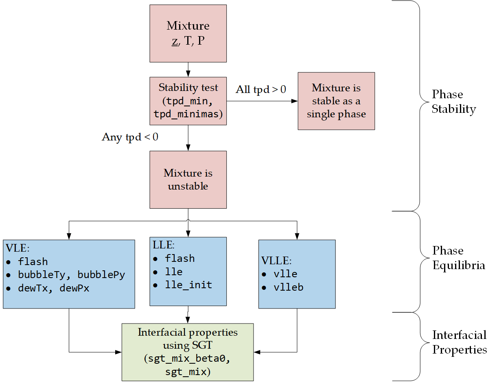

=============================================================================
59 – Phasepy: A Python Based Framework For Fluid Phase Equilibria Computation
=============================================================================

.. image:: https://mybinder.org/badge_logo.svg
   :target: https://mybinder.org/v2/gh/gustavochm/esat2021/HEAD

**ESAT 2021**

Gustavo Chaparro Maldonado, Andrés Mejía.
Departamento de Ingeniería Química, Universidad De Concepción, Concepción, Chile

Installation
------------

Get the latest version of SGTPy from
https://pypi.python.org/pypi/SGTPy/

If you have an installation of Python with pip, simple install it with:

    $ pip install phasepy

    $ pip install SGTPy

To get the git version, run:

    $ git clone https://github.com/gustavochm/phasepy

    $ git clone https://github.com/gustavochm/SGTPy

Documentation
-------------

Phasepy's documentation is available on the web:

    https://phasepy.readthedocs.io/en/latest/

SGTPy's documentation is available on the web (under development):

    https://sgtpy.readthedocs.io/en/latest/

Getting Started
---------------

Phasepy and SGTPy easily allows you to perform phase equilibria and interfacial
properties calculations. Phasepy includes on Gibbs excess models and cubic equations
of state (EoS) while SGTPy includes SAFT-VR-Mie EoS.
For both packages, first components are defined with their molecular parameters, then a mixture can be created with them.

.. code-block:: python

      >>> import numpy as np
      >>> from SGTPy import component, mixture, saftvrmie
      >>> ethanol = component('ethanol2C', ms=1.7728, sigma=3.5592 , eps=224.50,
                    lambda_r=11.319, lambda_a=6., eAB=3018.05, rcAB=0.3547,
                    rdAB=0.4, sites=[1,0,1], cii=5.3141080872882285e-20)
      >>> hexane = component('hexane', ms=1.96720036, sigma=4.54762477,
                               eps=377.60127994, lambda_r=18.41193194,
                               cii=3.581510586936205e-19)
      >>> mix = mixture(hexane, ethanol)
      >>> # fitted to experimental data
      >>> kij = 0.011818492037463553
      >>> Kij = np.array([[0, kij], [kij, 0]])
      >>> mix.kij_saft(Kij)
      >>> eos = saftvrmie(mix)

The eos object can be used to compute phase equilibria.

.. code-block:: python

      >>> from SGTPy.equilibrium import bubblePy
      >>> # computing bubble point
      >>> T = 298.15 # K
      >>> x = np.array([0.3, 0.7])
      >>> # initial guesses for vapor compotision and pressure
      >>> y0 = 1.*x
      >>> P0 = 8000. # Pa
      >>> sol = bubblePy(y0, P0, x, T, eos, full_output=True)

Finally, the equilibria results can be used to model the interfacial behavior of
the mixture using SGT.

.. code-block:: python

      >>> from SGTPy.sgt import sgt_mix
      >>> # reading solution object
      >>> y, P = sol.Y, sol.P
      >>> vl, vv = sol.v1, sol.v2
      >>> #density vector of each phase
      >>> rhox = x/vl
      >>> rhoy = y/vv
      >>> bij = 0.06486106024034907
      >>> beta = np.array([[0, bij], [bij, 0]])
      >>> eos.beta_sgt(beta)
      >>> #solving BVP of SGT with 25 colocation points
      >>> solsgt = sgt_mix(rhoy, rhox, T, P, eos, n=25, full_output=True)

For more examples, please have a look at the Jupyter Notebook files
located in this repo. Don't forget to try the examples located in
`phasepy-examples <https://github.com/gustavochm/esat2021/tree/master/phasepy-examples>`_ folder
and of the sources or `SGTPy-examples <https://github.com/gustavochm/esat2021/tree/master/SGTPy-examples>`_ folder.

License information
-------------------

Phasepy is part of the article *Phasepy: A Python based framework for fluid phase
equilibria and interfacial properties computation* by Gustavo Chaparro and Andrés Mejía,
J Comput Chem. 2020, 41, 29, 2504-2526. `https://doi.org/10.1002/jcc.26405 <https://doi.org/10.1002/jcc.26405>`_.

SGTPy is part of the article *SGTPy: A Python open-source code for
calculating the interfacial properties of fluids based on the Square Gradient
Theory using the SAFT-VR Mie equation of state* by Andrés Mejía,
Erich A. Müller and Gustavo Chaparro. J. Chem. Inf. Model., 2021, 61, 3, 1244–1250,
`https://doi.org/10.1021/acs.jcim.0c01324 <https://doi.org/10.1021/acs.jcim.0c01324>`_.

Although not required by the phasepy and SGTPy license, if it is convenient for you,
please cite phasepy and SGTPy if used in your work. Please also consider contributing
any changes you make back, and benefit the community.
